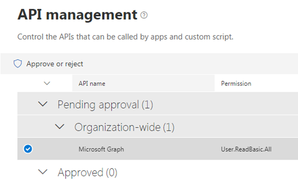
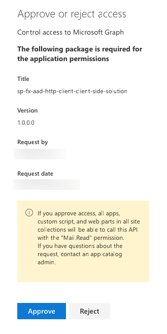
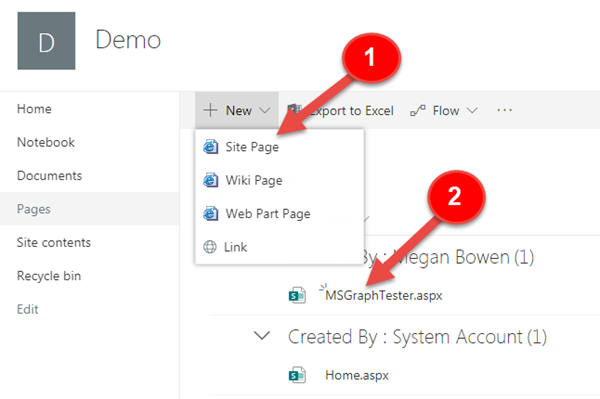
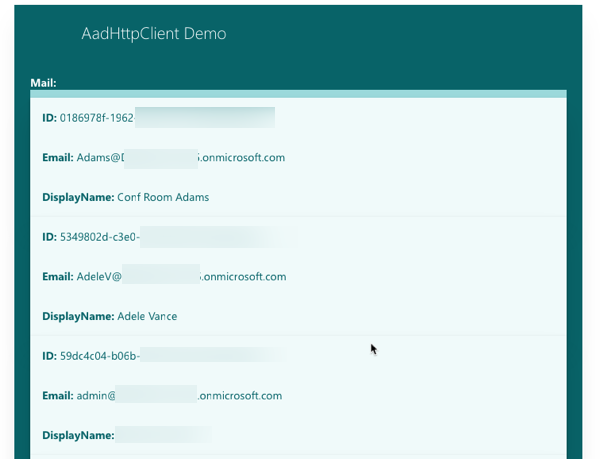

# Demo: Calling Azure AD Protected 3rd Party REST APIs

In this exercise you will test a client-side web part that uses React and the Microsoft Graph with the to display users in the currently logged in user's directory. You will use the Azure AD HTTP client API included in the SharePoint Framework to authenticate and call the Microsoft Graph REST API.

## Running the demo

1. Open a command prompt and change directory to the root of the application.
1. Execute the following command to download all necessary dependencies

    ```shell
    npm install
    ```

1. Create the SharePoint package for deployment:
    1. Build the solution by executing the following on the command line:

        ```shell
        gulp build
        ```

    1. Bundle the solution by executing the following on the command line:

        ```shell
        gulp bundle --ship
        ```

    1. Package the solution by executing the following on the command line:

        ```shell
        gulp package-solution --ship
        ```

1. Deploy and trust the SharePoint package:
    1. In the browser, navigate to your SharePoint Online Tenant App Catalog.

        >Note: Creation of the Tenant App Catalog site is one of the steps in the **[Getting Started > Set up Office 365 Tenant](https://docs.microsoft.com/sharepoint/dev/spfx/set-up-your-developer-tenant)** setup documentation.

    1. Select the **Apps for SharePoint** link in the navigation:

        

    1. Drag the generated SharePoint package from **/sharepoint/solution/sp-fx-aad-http-client.sppkg** into the **Apps for SharePoint** library.
    1. In the **Do you trust sp-fx-aad-http-client-side-solution?** dialog, select **Deploy**.

        

1. Approve the API permission request:
    1. Navigate to the SharePoint Admin Portal located at **https://{{REPLACE_WITH_YOUR_TENANTID}}-admin.sharepoint.com/_layouts/15/online/AdminHome.aspx**, replacing the domain with your SharePoint Online's administration tenant URL.

        >Note: At the time of writing, this feature is only in the SharePoint Online preview portal.

    1. In the navigation, select **Advanced > API Management**:

        

    1. Select the **Pending approval** for the **Microsoft Graph** permission **User.ReadBasic.All**.

        

    1. Select the **Approve or Reject** button, followed by selecting **Approve**.

        

1. Test the web part:

    >NOTE: The SharePoint Framework includes a locally hosted & SharePoint Online hosted workbench for testing custom solutions. However, the workbench will not work the first time when testing solutions that utilize the Microsoft due to nuances with how the workbench operates and authentication requirements. Therefore, the first time you test a Microsoft Graph enabled SPFx solution, you will need to test them in a real modern page.
    >
    >Once this has been done and your browser has been cookied by the Azure AD authentication process, you can leverage local webserver and SharePoint Online-hosted workbench for testing the solution.

    1. Add the web part to your site collection.
        1. In a browser, navigate to a SharePoint Online site.
        1. In the Office 365 gear, select **Add an App**.
        1. In site navigation, select **From your Organization**.
        1. Select `sp-fx-aad-http-client-side-solution` to add your web part.

        

    1. Setup environment to test the web part on a real SharePoint Online modern page in the same site collection where you added your web part:
        1. In the site navigation, select the **Pages** library.
        1. Select an existing page (*option 2 in the following image*), or create a new page (*option 1 in the following image*) in the library to test the web part on.

            

    1. Add the web part to the page and test:
        1. In the browser, select the Web part icon button to open the list of available web parts:

            

        1. Locate the **SPFxAadHttpClient** web part and select it

            

        1. When the page loads, notice after a brief delay, it will display a list of users:

            

1. Stop the local web server by pressing <kbd>CTRL</kbd>+<kbd>C</kbd> in the console/terminal window.
